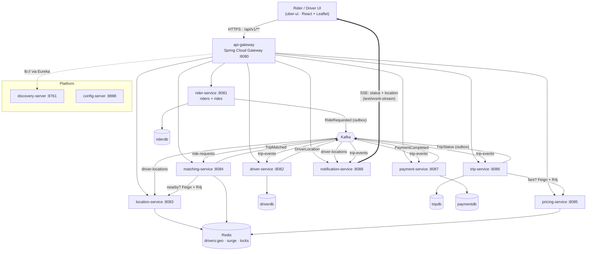
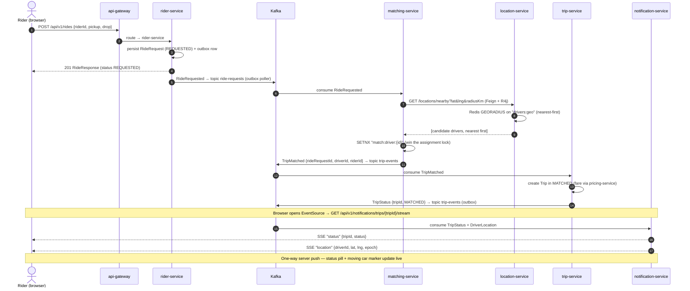
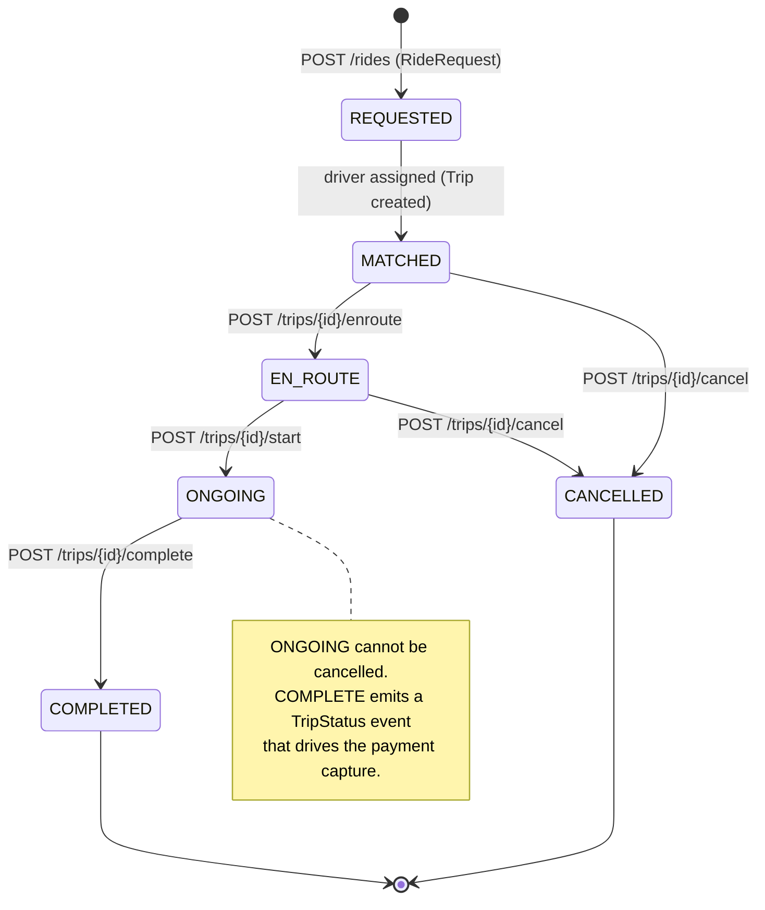
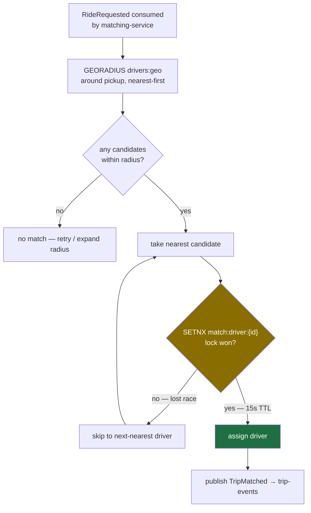

# Uber Platform — Diagrams

Mermaid diagrams generated from the actual services (`matching-service`, `location-service`,
`trip-service`, `notification-service`) and the `KafkaTopics` / event records in `common`.
All render on GitHub.

- [1. High-Level Design (HLD)](#1-high-level-design-hld)
- [2. Ride request → match → live stream (sequence)](#2-ride-request--match--live-stream-sequence)
- [3. Trip state machine](#3-trip-state-machine)
- [4. Geospatial matching + assignment race](#4-geospatial-matching--assignment-race)

---

## 1. High-Level Design (HLD)

The `common` module is a shared library (`ApiResponse`, enums, event records, `KafkaTopics`,
`GeoUtil`), not a running service — so it has no node above.

---

## 2. Ride request → match → live stream (sequence)

The end-to-end showcase: a rider taps *Request ride*, geospatial matching picks the nearest
free driver under a lock, a trip is minted, and the driver's position streams to the browser.

---

## 3. Trip state machine

Legal transitions come straight from `trip-service`'s `TripStateMachine.ALLOWED`. The `Trip`
aggregate is created directly in `MATCHED`; `REQUESTED` is the `RideRequest` state before a
trip exists (shown as the entry).

`ONGOING` has no cancel edge; illegal transitions throw `IllegalStateException` → HTTP 409
`ILLEGAL_TRIP_TRANSITION`.

---

## 4. Geospatial matching + assignment race

Why the lock exists: two ride requests near the same driver would otherwise both pick it.

The lock (`match:driver:{driverId}`, Redis `SETNX` with a 15s TTL) makes the assignment
atomic: the first request to win the key gets the driver; concurrent requests fall through to
the next-nearest candidate instead of double-booking. Driver positions only exist in Redis
`drivers:geo` after the driver sends location pings (`POST /api/v1/drivers/{id}/location`),
which is why the UI's *simulate movement* toggle is what makes a driver matchable.
